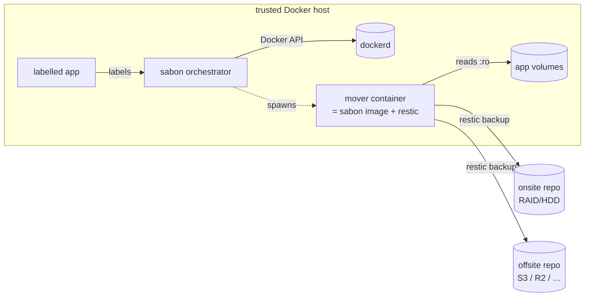

<div align="center">

# sabon

**Label-driven restic backup orchestrator for Docker.**

_사본 — Korean for "a copy". Declare a backup next to the service; sabon does the rest._

[](https://github.com/davidborzek/sabon/actions/workflows/ci.yaml)
[](https://github.com/davidborzek/sabon/releases/latest)
[](https://davidborzek.github.io/sabon/)
[](LICENSE)

</div>

> [!WARNING]
> Early-stage software. Labels and configuration may change before `v1`.

sabon watches the Docker API for containers that carry a backup **label**, and on a
schedule spawns ephemeral **mover** containers that run [restic](https://restic.net)
— so every backup is incremental, deduplicated and encrypted — to back each app's
volumes up to its own repository, onsite, offsite, or both.
The backup spec lives next to the service in your Compose file; there is no central
list of apps to maintain.

## How it works



- **Discovery** — every container with `sabon.enable: "true"` and a `sabon.backup`
  spec is a job. Its sources are the container's own bind mounts and named volumes
  (plus anything the label adds).
- **Movers** — per scheduled run sabon starts a throwaway container from *its own
  image* (which bundles the `restic` binary), mounts the sources read-only, and runs
  `restic backup` then `restic forget` (retention marking). sabon never runs restic
  itself; reclaiming space with `prune` is a separate, less frequent job.
- **Per-app, per-target repositories** — each app gets an isolated repo in each
  target, so restores and retention are independent and blast radius is small.
- **Any volume** — because a mover *mounts* the volume, sabon backs up named volumes
  (any driver) as well as bind mounts, without poking at `/var/lib/docker`.
- **Consistency** — dump a database in a pre-hook, quiesce an app with
  `stop: true`, or back up from an atomic ZFS snapshot with no downtime
  (`snapshot: zfs`, or `auto` to snapshot what's on ZFS and mount the rest live).
- **Standalone or Swarm** *(experimental)* — drives a single Docker host by default; on a Docker
  Swarm manager it drives the whole cluster, running each mover as a node-pinned
  service. See [Deployment](docs/deployment.md#swarm).

## Quick start

```yaml
# compose.yaml (excerpt — see examples/ for a full, runnable stack)
services:
  sabon:
    image: ghcr.io/davidborzek/sabon
    environment:
      RESTIC_PASSWORD: ${RESTIC_PASSWORD}
    volumes:
      - /var/run/docker.sock:/var/run/docker.sock   # needs Docker write (spawns movers)
      - ./targets.yaml:/etc/sabon/targets.yaml:ro
      - /mnt/backup:/mnt/backup                      # onsite repo location
      - sabon-cache:/cache

  immich-server:
    image: ghcr.io/immich-app/immich-server
    labels:
      sabon.enable: "true"
      sabon.backup: |
        repo: immich
        extraVolumes: [immich-dbdump]         # a consistent dump written by the hook below
        preHooks:
          - container: immich-postgres
            command: [sh, -c, "pg_dump -U $$POSTGRES_USER -d $$POSTGRES_DB -f /dump/immich.sql"]
    # ...

volumes:
  sabon-cache:
```

```yaml
# targets.yaml
targets:
  - name: onsite
    path: /mnt/backup                    # repo = /mnt/backup/<app>
    schedule: "0 0 */6 * * *"            # every 6h (6-field cron, seconds first)
    retention: { hourly: 24, daily: 7, weekly: 5 }
```

Then preview with `docker compose exec sabon /sabon validate`, and let the daemon
schedule the rest.

## Restore

sabon's CLI runs **inside the container** — invoke it via `docker compose exec`
(or `docker exec <container> sabon …`):

```bash
docker compose exec sabon /sabon snapshots --app immich --target onsite
docker compose exec sabon /sabon restore --app immich --target onsite --into /tmp/immich-restore  # safe staging
docker compose exec sabon /sabon restore --app immich --target onsite --in-place --stop           # into live volumes
```

## Documentation

- **[Architecture](docs/architecture.md)** — orchestrator, movers, lifecycle & crash behaviour
- **[Configuration](docs/configuration.md)** — `SABON_*` env and the targets file
- **[Labels](docs/labels.md)** — the `sabon.backup` spec
- **[Hooks](docs/hooks.md)** — pre/post hooks (`exec` and one-shot `run` modes), DB dumps
- **[Backups](docs/backups.md)** — retention, consistency, snapshots, notifications
- **[Restore](docs/restore.md)** — staging vs in-place, path mapping, DB restore
- **[Deployment](docs/deployment.md)** — Compose, Docker socket hardening, security
- **[Observability](docs/metrics.md)** — Prometheus metrics, health endpoints, and notifications
- **[LABEL-SPEC.md](LABEL-SPEC.md)** — the cross-tool label convention

## Security

sabon needs **write** access to the Docker API — it creates, starts and removes
mover containers and mounts arbitrary volumes. Movers run as **root** (they must read
all app data and write repositories). Run sabon on a trusted host (a Swarm manager for cluster mode); harden the
socket with a POST-enabled [docker-socket-proxy](docs/deployment.md) if you don't want
to mount the raw socket. See [SECURITY.md](SECURITY.md).

## Development

```bash
go build ./...
go test ./...
go run github.com/golangci/golangci-lint/v2/cmd/golangci-lint@latest run ./...
sabon schema            # regenerate schemas/backup.json

pip install zensical    # docs: preview at http://127.0.0.1:8000
zensical serve
```

## License

[MIT](LICENSE) © 2026 David Borzek
