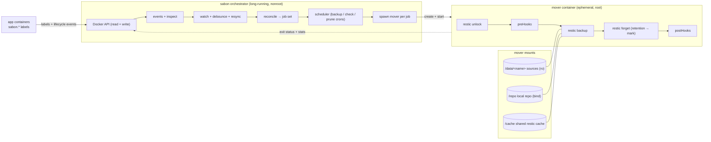

# Architecture

sabon is a label-driven restic backup orchestrator for a single Docker host. It
recreates the ergonomics of a Kubernetes backup operator (the pattern is
Volsync-style) for plain Docker / Compose: container labels declare what to back
up and to which targets, and sabon schedules and runs those backups by spawning
short-lived **mover** containers.

The key split is that **sabon never runs restic itself.** The orchestrator
discovers work and schedules it; each actual backup runs in an ephemeral mover
container. This keeps the long-running daemon simple, lets in-flight backups
survive an orchestrator restart, and means each job mounts exactly the named
volumes (and paths) it needs **on demand** — the daemon never has to mount
everything up front.

## Orchestrator and movers

The diagram shows a **backup** job. `check` and `prune` reuse the same
ephemeral-mover machinery with a different action and no hooks: `restic check`
(repository integrity) and `restic prune` (repack to reclaim the space that
`forget` only *marked*), each on its own per-target cron. All three actions take
the same per-repo lock, so they never run against one repository concurrently.

For each backup job the mover mounts:

- every source (bind path or named volume) **read-only** at `/data/<name>`,
- the local repository as a bind at `/repo` (remote repositories are reached over
  the network using credentials from the target's `env`),
- a shared restic **cache** volume (`SABON_CACHE_VOLUME`, default `sabon-cache`)
  at `/cache`, so repeated backups don't re-read pack metadata.

Movers use **sabon's own image** — it bundles the restic binary — so there is no
second image to manage. Movers run **as root** (`SABON_MOVER_USER`, default
`0:0`) because they must read arbitrary application data and write repositories;
the orchestrator itself can stay nonroot. See
[Deployment](deployment.md#privileges) for the privilege model.

## Repositories: per-app, per-target

A **target** (defined in the targets file, see
[Configuration](configuration.md)) is a backend, and every app gets its own
repository inside it:

- **Local target** — `path: /mnt/backup` → the repo for app `paperless` is
  `/mnt/backup/paperless`.
- **Remote target** — `repo: "s3:${R2_ENDPOINT}/${R2_BUCKET}/{app}"`; the
  `{app}` placeholder expands to the app name and `${ENV}` placeholders expand
  from the environment.

So a single app backed up to two targets lives in two independent restic
repositories. Snapshots, retention and restores are always scoped to one
`(app, target)` pair.

## Discovery

Discovery is event-driven with a periodic safety net:

- **Watch** — sabon subscribes to `docker events` and reacts to container
  lifecycle changes.
- **Resync** — a full re-list every `SABON_RESYNC_INTERVAL` (default `5m`) catches
  missed events and restarts.
- **Debounce** — bursts of events are coalesced with `SABON_DEBOUNCE_DELAY`
  (default `2s`) so a `docker compose up` triggers one reconcile, not dozens.

Each reconcile rebuilds the desired **job set** from the current containers plus
the targets file. A container is included when it carries `sabon.enable=true`
(or, with `SABON_WATCH_BY_DEFAULT=true`, when it does *not* carry
`sabon.enable=false`). Discovery does not run backups; the scheduler does, on
each target's cron schedule.

**Stopped** containers are included too: their volumes persist and a cold
container is the most consistent state, so stopping a service never silently
stops its backups.

## Per-repo serialization

restic repositories do not tolerate concurrent writers well, so sabon
**serializes runs against the same repository** with a per-repo lock. Two
different apps (different repos) back up in parallel; two schedules that would hit
the *same* repo at once are run one after another. Before every backup the mover
also runs `restic unlock` to clear any stale lock left behind by a mover that was
killed mid-run.

## Lifecycle and robustness

Because movers are independent containers, sabon's own lifecycle never
interrupts a backup in progress:

- **Orchestrator crash** — running movers keep going and finish their backup on
  their own. Nothing is lost just because the daemon died.
- **Startup and each resync** — sabon reaps only **exited** mover containers
  (cleaning up finished work). Movers still **running** from a previous
  orchestrator instance are left alone to complete.
- **Graceful shutdown** (SIGINT / SIGTERM) — in-flight movers are **left
  running**, not killed; they finish and are reaped by the next instance.
- **Stale locks** — a mover that was force-killed can leave a restic lock in the
  repo. The next backup's `restic unlock` clears it, so a crash never wedges the
  repository.

The net effect: the worst case for an orchestrator restart is a slightly delayed
reap of a finished mover, never a corrupted repo or a half-run backup.
